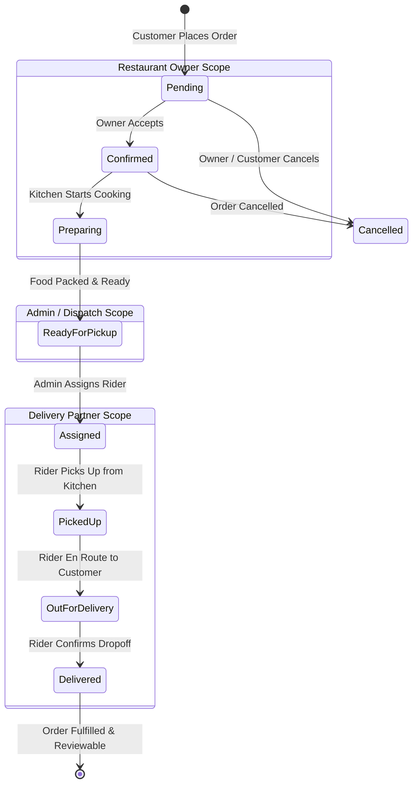
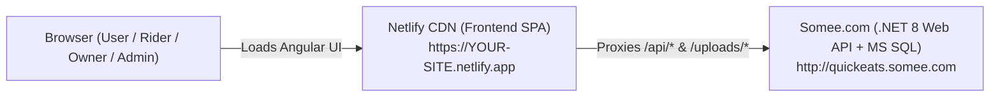

# 🍽️ QuickEats — Multi-Role Food Ordering & Delivery Management Platform

[](https://dotnet.microsoft.com/)
[](https://angular.dev/)
[](https://www.typescriptlang.org/)
[](https://learn.microsoft.com/ef/core/)
[](https://www.microsoft.com/sql-server)
[](https://jwt.io/)
[](LICENSE)

> **QuickEats** is an enterprise-grade, full-stack food delivery and operational management platform. Built with **ASP.NET Core 8 Web API** and **Angular (Standalone Architecture)**, it unifies **Customers**, **Restaurant Owners**, **Delivery Partners (Riders)**, and **Platform Administrators** into a real-time, role-isolated, end-to-end food ordering and fulfillment ecosystem.

---

## 🌐 Live Demo & Repository Links

- **GitHub Repository**: [https://github.com/Mrudula1208/QuickEats](https://github.com/Mrudula1208/QuickEats)
- **Live Frontend (Netlify)**: `https://quickeats-web.netlify.app` *(or your custom Netlify URL)*
- **Live Backend API & Swagger (Somee)**: [http://quickeats.somee.com/swagger](http://quickeats.somee.com/swagger)
- **Live Backend Base URL**: [http://quickeats.somee.com](http://quickeats.somee.com)

---

## 📸 Screenshots & Visual Walkthrough

> *Screenshots are stored in the [`/screenshots`](./screenshots) directory.*

| 🛒 Customer Storefront & Live Tracker | 🍳 Restaurant Owner Kitchen Manager |
| :---: | :---: |
| <br><sub>*Home, Food Catalog, Live Cart & Real-Time Order Timeline*</sub> | <br><sub>*Multi-Tenant Kitchen Queue & Sequential Status Updates*</sub> |

| 🛵 Delivery Partner Operational Portal | 🛡️ Platform Admin Operations Hub |
| :---: | :---: |
| <br><sub>*Dedicated Mobile-First Rider Operations & Active Deliveries*</sub> | <br><sub>*Rider Roster, Partner Dispatching & System Analytics*</sub> |

---

## 🚀 Key Features by User Role

### 1. 🛒 Customer Experience
- **Interactive Landing & Storefront**: Hero banner with live stats, cuisine filter chips, top-rated restaurants, trending dishes, and local kitchens.
- **Menu Exploration & Filtering**: Search dishes/restaurants, filter by veg/non-veg, ratings, and operating hours with real-time bestseller badges.
- **Cart & Wishlist**: Real-time reactive cart with item counters, delivery fee calculations, and persistent favorites.
- **Checkout & Promotions**: Dynamic discount coupon validation, saved delivery addresses, and dual payment support (Credit/Debit Card via Mock Gateway or Cash on Delivery).
- **Live Order & Delivery Tracking**: Real-time visual timeline (`Pending` ➔ `Confirmed` ➔ `Preparing` ➔ `Ready for Pickup` ➔ `Out for Delivery` ➔ `Delivered`), order receipt breakdown, and driver contact info.
- **Customer Feedback & Support**: Restaurant reviews with star ratings, searchable multi-category FAQ, and support ticketing.

### 2. 🍳 Restaurant Owner Portal *(Strict Multi-Tenant Isolation)*
- **Isolated Owner Dashboard**: Scoped revenue metrics, active order volume, top-selling items, and customer ratings calculated strictly for the authenticated owner's restaurants.
- **Kitchen Order Management**: Real-time live order processing with sequential status progression (`Confirm Order` ➔ `Start Preparing` ➔ `Mark Ready for Pickup`).
- **Menu & Catalog Control**: Add/edit/delete dishes, upload high-res food images, toggle item availability, configure discounts, and flag bestsellers.
- **Restaurant Profile Management**: Update operating hours, delivery fees, minimum order thresholds, and contact information.
- **Owner Review Insights**: Read customer reviews filtered exclusively for their own establishments.

### 3. 🛵 Delivery Partner Portal *(Operational Rider Hub)*
- **Dedicated Operational UI**: Lightweight, mobile-first dashboard with instant Online/Offline duty status toggle.
- **Active Task Dispatcher**: Real-time list of assigned delivery tasks with direct navigation to pickup restaurant and customer drop-off addresses.
- **Live Delivery Stepper**: Detailed order delivery view with one-touch phone dialer, copy address shortcuts, and strictly validated sequential action buttons (`Pickup Order` ➔ `Start Delivery` ➔ `Confirm Delivery`).
- **Completed Delivery History**: Searchable and filterable archive of delivered orders with earnings and tip summaries.
- **Rider Profile & Performance**: Track lifetime completed deliveries, active jobs, and account credentials.

### 4. 🛡️ Platform Administrator Hub
- **Executive Analytics Dashboard**: Platform-wide metrics (Gross Revenue, Total Orders, Active Restaurants, Customers, Owners, and Delivery Partners).
- **Delivery Fleet Management (`/admin/delivery-partners`)**: Manage delivery partner accounts, inspect active vs. completed deliveries, toggle active/inactive status, and register new riders.
- **Dispatch & Assignment Center (`/admin/delivery`)**: Real-time delivery assignment matrix to assign or reassign available riders to ready orders.
- **Restaurant Directory & Moderation**: Approve, activate, deactivate, or delete restaurants across the platform.
- **User & Catalog Governance**: Manage users, maintain categories, create promo coupon campaigns with minimum spend rules, and moderate user reviews.

---

## 🔄 End-to-End Order & Delivery State Machine



---

## 🏗️ System Architecture & Data Isolation

```
QuickEats/
├── backend/QuickEats.API/            # ASP.NET Core 8 Web API
│   ├── Controllers/                  # RESTful API Endpoints (Role-Protected)
│   ├── Services/                     # Business Logic Layer (+ Interfaces)
│   ├── Repositories/                 # Data Access Layer (Repository Pattern)
│   ├── Models/                       # Entity Framework Core 8 Data Models
│   ├── DTos/                         # Request / Response Data Transfer Objects
│   ├── Data/                         # AppDbContext & Database Configurations
│   ├── Migrations/                   # EF Core Migration Snapshots
│   └── Middleware/                   # Global Exception & Request Logging
│
├── frontend/quickeats-web/           # Angular 18+ Standalone SPA
│   ├── src/app/
│   │   ├── core/                     # Singleton Services, Models & Interceptors
│   │   ├── features/
│   │   │   ├── customer/             # Home, Restaurants, Menu, Cart, Checkout, Tracking
│   │   │   ├── owner/                # Dashboard, Orders, Menus, Restaurants, Reviews
│   │   │   ├── delivery-partner/     # Dashboard, Deliveries, Details, History, Profile
│   │   │   ├── admin/                # Users, Delivery Partners, Analytics, Coupons
│   │   │   └── auth/                 # Login & Registration Flow
│   │   ├── guards/                   # Role Guards (Auth, Admin, Owner, DeliveryPartner)
│   │   ├── interceptors/             # AuthInterceptor (JWT Bearer Injection)
│   │   └── layout/                   # Navbar, Footer, & Dedicated Delivery Header/Nav
│
├── database/                         # SQL Initialization Scripts & Data Dumps
├── screenshots/                      # High-Resolution UI Mockups & Showcase Images
└── QuickEats.sln                     # Visual Studio Solution File
```

### 🔒 Multi-Tenant Data Isolation Strategy
- **Backend Enforced**: Every owner request extracts the authenticated `UserId` from the cryptographically verified JWT claims (`ClaimTypes.NameIdentifier`). Repositories enforce LINQ queries filtering strictly by `Restaurant.OwnerId == currentUserId`.
- **Status Guardrails**: State transitions are bounded at the API level (`OrderController` & `OrderDeliveryController`) preventing unauthorized jumps (e.g. owners cannot mark an order `Delivered`; riders cannot skip `Picked Up`).
- **Client-Side Role Routing**: Angular route guards (`delivery-partner.guard.ts`, `owner.guard.ts`, `admin.guard.ts`, `auth.guard.ts`) protect UI routes and automatically route users to their respective operational consoles upon login.

---

## 💻 Tech Stack

| Layer | Technologies | Description |
| :--- | :--- | :--- |
| **Backend API** | **ASP.NET Core 8 Web API** | Clean architecture RESTful Web API |
| **ORM & Database** | **Entity Framework Core 8**, **SQL Server** | Code-First migrations, Linq queries, Relational schema |
| **Authentication** | **JWT Bearer**, **BCrypt.Net** | Secure claims-based authentication and salted password hashing |
| **API Documentation** | **Swagger / OpenAPI (Swashbuckle)** | Interactive API testing documentation with XML comments |
| **Frontend SPA** | **Angular 18+ (Standalone)** | Component-based, TypeScript, RxJS, Reactive Forms |
| **Styling & Icons** | **Custom SCSS**, **FontAwesome**, **ngx-toastr** | Modern responsive design, mobile-first layouts, toast notifications |

---

## 🔑 Demo Login Credentials

For testing and grading the multi-role platform, pre-seeded accounts are provided:

| Role | Email | Password | Primary Portal Route |
| :--- | :--- | :--- | :--- |
| 🛡️ **Administrator** | `admin@gmail.com` | `Admin@123` | `/admin/dashboard` |
| 🍳 **Restaurant Owner** | `owner@gmail.com` | `Owner@123` | `/owner/dashboard` |
| 🛵 **Delivery Partner** | `rider@gmail.com` | `Password@123` | `/delivery/dashboard` |
| 🛒 **Customer** | `customer@gmail.com` | `Password@123` | `/restaurants` |

---

## ⚙️ Local Installation & Setup

### Prerequisites
- [.NET 8.0 SDK](https://dotnet.microsoft.com/download/dotnet/8.0)
- [Node.js (v18 or v20 LTS)](https://nodejs.org/) & `npm`
- [SQL Server (LocalDB or Express or SQL Server 2019/2022)](https://www.microsoft.com/sql-server)

---

### 1. Backend Setup (.NET 8 Web API)

```bash
# 1. Navigate to the backend project
cd backend/QuickEats.API/QuickEats.API

# 2. Configure JWT Key in user-secrets (minimum 32 characters)
dotnet user-secrets set "Jwt:Key" "YourSuperSecretKeyWithAtLeast32CharactersLong!"

# 3. Apply EF Core Migrations to create the SQL Server Database
dotnet ef database update

# 4. Start the Backend API
dotnet run
```
> The API will start on `https://localhost:7278` (or `http://localhost:5243`).
> Explore the interactive Swagger docs at: `https://localhost:7278/swagger`

---

### 2. Frontend Setup (Angular 18+)

```bash
# 1. Navigate to the frontend project
cd frontend/quickeats-web

# 2. Install dependencies
npm install

# 3. Start the Angular development server
npm start
```
> Open your browser and navigate to: `http://localhost:4200`

---

## 🌐 Production & Live Deployment Architecture (Somee + Netlify)

QuickEats is configured for zero-CORS production hosting using **Somee.com** for the backend/database and **Netlify** for the frontend SPA:



### 1. Database & Backend API Hosting (Somee.com)
1. **MS SQL Database on Somee**:
   - Create a free MS SQL database on [Somee.com](https://somee.com).
   - Execute the database schema script [`QuickEats_Somee_Data_Import.sql`](./QuickEats_Somee_Data_Import.sql) in the Somee SQL query tool.
2. **Publish & Deploy .NET 8 Web API**:
   - Run `dotnet publish -c Release -o ./QuickEats-Publish` from the backend directory.
   - Upload the generated contents of the [`QuickEats-Publish/`](./QuickEats-Publish) folder to your Somee website root via Somee File Manager or FTP.
   - Your API and interactive Swagger will be live at: `http://quickeats.somee.com/swagger`

### 2. Frontend SPA Hosting (Netlify)
1. **Zero-CORS Proxy Configuration**:
   - The repository includes [`frontend/quickeats-web/netlify.toml`](./frontend/quickeats-web/netlify.toml) which automatically forwards all `/api/*` and `/uploads/*` requests directly to `http://quickeats.somee.com`.
2. **Deploy from GitHub**:
   - In [Netlify](https://app.netlify.com), click **Add new site** > **Import an existing project** > connect `https://github.com/Mrudula1208/QuickEats`.
   - **Base directory**: `frontend/quickeats-web`
   - **Build command**: `npm run build`
   - **Publish directory**: `frontend/quickeats-web/dist/quickeats-web/browser`
3. Click **Deploy Site**. Netlify will automatically build and serve your app at `https://<your-site-name>.netlify.app`.

---

## 📸 Recommended Screenshots Guide for GitHub

To make your GitHub repository stand out to hiring managers and recruiters, capture and add the following 8 screenshots into the `screenshots/` directory:

| Filename | Page / Route | What to Highlight |
| :--- | :--- | :--- |
| `01_customer_home.png` | `http://localhost:4200/` | Hero banner, live stats, cuisine chips, featured restaurants. |
| `02_customer_menu_cart.png` | `http://localhost:4200/restaurants/1` | Menu category filters, veg/non-veg tags, floating cart with price. |
| `03_owner_kitchen_orders.png` | `http://localhost:4200/owner/orders` | Live kitchen order queue with Confirm / Prepare / Ready buttons. |
| `04_owner_dashboard.png` | `http://localhost:4200/owner/dashboard` | Revenue graph, today's order metrics, top items for the owner. |
| `05_delivery_partner_dashboard.png` | `http://localhost:4200/delivery/dashboard` | Active assigned deliveries, rider duty switch, today's summary. |
| `06_delivery_partner_details.png` | `http://localhost:4200/delivery/deliveries/1` | Order receipt, pickup & dropoff coordinates, step action buttons. |
| `07_admin_delivery_management.png` | `http://localhost:4200/admin/delivery` | Rider assignment modal, delivery status grid, active KPI cards. |
| `08_admin_analytics.png` | `http://localhost:4200/admin/dashboard` | Platform metrics, revenue summaries, user management. |

---

## 💼 Resume Project Description & Bullet Points

Use these high-impact bullet points when adding **QuickEats** to your resume or LinkedIn portfolio:

```markdown
**QuickEats — Enterprise Multi-Role Food Delivery & Operations Platform**
*ASP.NET Core 8 Web API, Angular 18+, Entity Framework Core, SQL Server, JWT Auth, TypeScript, RxJS*

- Architected a full-stack, 4-tier food delivery ecosystem supporting Customer, Restaurant Owner, Delivery Partner, and Admin roles with JWT-based role and claim authorization.
- Engineered a strict multi-tenant data isolation architecture ensuring restaurant owners can only access, monitor, and modify their own catalog, revenue, order queues, and customer reviews.
- Developed a real-time, mobile-first Delivery Partner Portal with availability controls, geo-routing details, and an atomic state-machine workflow (Assigned ➔ Picked Up ➔ Out for Delivery ➔ Delivered).
- Implemented clean architecture using Repository & Service patterns in ASP.NET Core 8 with EF Core Code-First migrations, automated database seeding, and global exception-handling middleware.
- Built a high-performance Angular frontend with standalone components, route guards, HTTP interceptors for automatic Bearer token injection, and reactive state management via RxJS.
```

---

## 📄 License

This project is licensed under the [MIT License](LICENSE) - see the LICENSE file for details.

---

<p align="center">
  <b>QuickEats</b> • Built with ❤️ using <b>ASP.NET Core 8</b> & <b>Angular</b>
</p>
