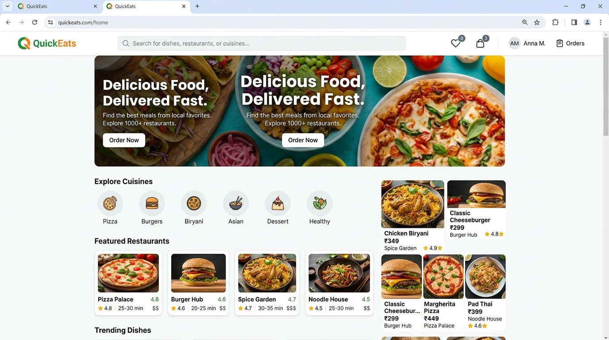
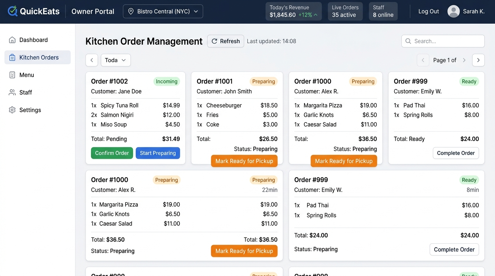
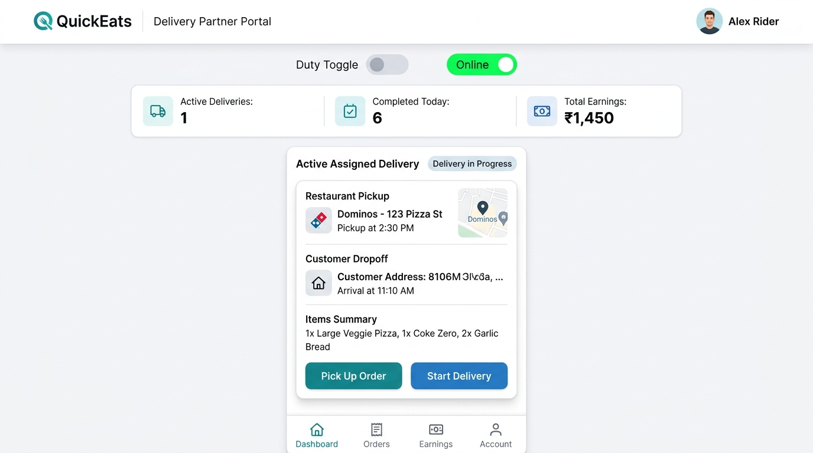
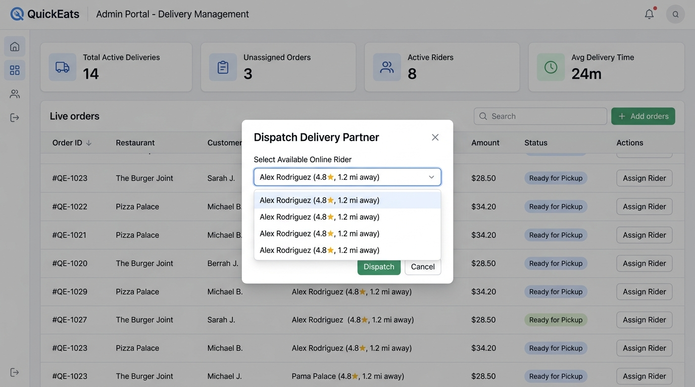

# QuickEats

QuickEats is a full-stack food delivery and restaurant management web application built using **ASP.NET Core 8 Web API** and **Angular 18 (Standalone Components)**.

The system handles the entire food ordering lifecycle across four distinct user roles:
- **Customers**: Browse menus, manage cart/wishlist, place orders, and track deliveries in real time.
- **Restaurant Owners**: Manage restaurants, menu items, pricing, and process incoming kitchen orders with strict data isolation.
- **Delivery Partners**: Mobile-first rider interface to manage duty status, view assigned deliveries, and execute order drop-offs.
- **Administrators**: Platform-wide management of users, restaurants, rider dispatching, promo coupons, and analytics.

---

## Live Links

- **Frontend Application (Netlify)**: [https://quickeats-web.netlify.app](https://quickeats-web.netlify.app)
- **Backend API & Swagger UI (Somee)**: [http://quickeats.somee.com/swagger](http://quickeats.somee.com/swagger)
- **GitHub Repository**: [https://github.com/Mrudula1208/QuickEats](https://github.com/Mrudula1208/QuickEats)

---

## Demo Login Credentials

Pre-seeded accounts are available for testing each role:

| Role | Email | Password | Access / Portal |
| :--- | :--- | :--- | :--- |
| **Customer** | `customer@gmail.com` | `Password@123` | Storefront, Cart, Checkout, Order Tracking |
| **Restaurant Owner** | `owner@gmail.com` | `Owner@123` | Owner Dashboard, Menus, Kitchen Queue |
| **Delivery Partner** | `rider@gmail.com` | `Password@123` | Rider Dashboard, Active Deliveries, History |
| **Admin** | `admin@gmail.com` | `Admin@123` | Full Admin Console, Dispatch, User Management |

---

## Screenshots

| Customer Storefront | Owner Kitchen Orders |
| :---: | :---: |
|  |  |

| Delivery Partner Portal | Admin Dispatch & Analytics |
| :---: | :---: |
|  |  |

---

## Order Fulfillment Workflow

The application enforces a sequential state machine for all orders:

```
[Customer] Places Order (Pending)
       │
       ▼
[Owner] Confirms Order ──► Starts Preparing ──► Marks Ready for Pickup
                                                        │
       ┌────────────────────────────────────────────────┘
       ▼
[Admin] Assigns Available Delivery Partner (Assigned)
       │
       ▼
[Rider] Picks up from Restaurant (Picked Up)
       │
       ▼
[Rider] In Transit to Customer (Out for Delivery)
       │
       ▼
[Rider] Confirms Drop-off (Delivered)
```

---

## Technical Highlights & Architecture

### 1. Multi-Tenant Restaurant Owner Data Isolation
- Owner endpoints extract the authenticated user's ID directly from the validated JWT token (`ClaimTypes.NameIdentifier`).
- Database queries are scoped at the repository level (`Restaurant.OwnerId == currentUserId`), preventing owners from viewing or modifying orders, menus, revenue, or customer reviews of other restaurants.

### 2. State Machine Validation
- Order and delivery transitions are validated on the backend before updating database state.
- Restaurant owners can only advance orders through `Confirmed` ➔ `Preparing` ➔ `Ready for Pickup`.
- Delivery partners can only advance assigned deliveries through `Picked Up` ➔ `Out for Delivery` ➔ `Delivered`.

### 3. Production Deployment Architecture
- **Backend**: Hosted on Somee.com with ASP.NET Core 8 Web API and Microsoft SQL Server.
- **Frontend**: Hosted on Netlify with reverse-proxy rewrite rules (`netlify.toml`) forwarding `/api/*` and `/uploads/*` requests to the Somee backend, eliminating browser CORS issues.

---

## Tech Stack

- **Backend**: ASP.NET Core 8 Web API, C#
- **ORM & Database**: Entity Framework Core 8, Microsoft SQL Server
- **Security & Auth**: JWT Bearer Authentication, BCrypt password hashing, Claims-based Authorization
- **Frontend**: Angular 18+ (Standalone Components), TypeScript, RxJS
- **Styling**: SCSS, FontAwesome, ngx-toastr
- **API Documentation**: Swagger / OpenAPI (Swashbuckle)

---

## Project Structure

```
QuickEats/
├── backend/QuickEats.API/
│   └── QuickEats.API/
│       ├── Controllers/          # REST endpoints grouped by domain
│       ├── Services/             # Business logic layer (+ Interfaces)
│       ├── Repositories/         # EF Core data access layer (+ Interfaces)
│       ├── Models/               # Entity Framework database entities
│       ├── DTos/                 # Request & response data transfer objects
│       ├── Data/                 # AppDbContext and model configurations
│       ├── Migrations/           # EF Core schema migrations
│       ├── Middleware/           # Global exception handling
│       └── wwwroot/uploads/      # Static image assets (restaurants, menus)
│
├── frontend/quickeats-web/
│   ├── src/app/
│   │   ├── core/                 # Auth services, HTTP services, models, interceptors
│   │   ├── features/
│   │   │   ├── customer/         # Home, menus, cart, checkout, tracking, reviews
│   │   │   ├── owner/            # Dashboard, kitchen orders, menu CRUD, restaurants
│   │   │   ├── delivery-partner/ # Rider dashboard, deliveries, task details, profile
│   │   │   ├── admin/            # Rider dispatch, user management, category/coupon CRUD
│   │   │   └── auth/             # Login and registration forms
│   │   ├── guards/               # Auth, Admin, Owner, DeliveryPartner route guards
│   │   ├── interceptors/         # JWT Bearer token injector & error handler
│   │   └── layout/               # Header, footer, and rider layout components
│   └── netlify.toml              # Netlify build and API reverse-proxy configuration
│
└── QuickEats-Publish/            # Compiled production binaries for Somee deployment
```

---

## Local Development Setup

### Prerequisites
- [.NET 8 SDK](https://dotnet.microsoft.com/download/dotnet/8.0)
- [Node.js](https://nodejs.org/) (v18 or v20 LTS) & `npm`
- [SQL Server](https://www.microsoft.com/sql-server) (LocalDB, Express, or standard edition)

---

### Backend Setup

1. Open a terminal and navigate to the backend directory:
   ```bash
   cd backend/QuickEats.API/QuickEats.API
   ```

2. Set the JWT secret key (minimum 32 characters):
   ```bash
   dotnet user-secrets set "Jwt:Key" "YourSuperSecretKeyWithAtLeast32CharactersLong!"
   ```

3. Update the database using EF Core Migrations:
   ```bash
   dotnet ef database update
   ```

4. Run the API:
   ```bash
   dotnet run
   ```
   The API will start on `http://localhost:5243` and Swagger UI will be available at `https://localhost:7278/swagger` (or `http://localhost:5243/swagger`).

---

### Frontend Setup

1. Open a second terminal and navigate to the frontend directory:
   ```bash
   cd frontend/quickeats-web
   ```

2. Install dependencies:
   ```bash
   npm install
   ```

3. Start the Angular development server:
   ```bash
   npm start
   ```
   Open `http://localhost:4200` in your browser.

---

## Key API Endpoints Overview

| Method | Endpoint | Access | Description |
| :--- | :--- | :--- | :--- |
| `POST` | `/api/Auth/login` | Public | Authenticates user and returns JWT token |
| `POST` | `/api/Auth/register` | Public | Registers a new Customer or Restaurant Owner |
| `GET` | `/api/Restaurant` | Public | Lists all active restaurants |
| `GET` | `/api/Menu/restaurant/{id}` | Public | Returns menu items for a restaurant |
| `POST` | `/api/Order` | Customer | Places a new food order |
| `GET` | `/api/Order/my-orders` | Customer | Returns order history for logged-in customer |
| `GET` | `/api/Order/owner/orders` | Owner | Returns kitchen order queue (scoped to owner) |
| `PUT` | `/api/Order/{id}/status` | Owner / Admin | Updates order status (Confirmed, Preparing, Ready) |
| `GET` | `/api/OrderDelivery/my-deliveries` | DeliveryPartner | Returns assigned deliveries for logged-in rider |
| `PUT` | `/api/OrderDelivery/{id}` | DeliveryPartner | Updates delivery status (Picked Up, Out for Delivery, Delivered) |
| `POST` | `/api/OrderDelivery` | Admin | Dispatches and assigns rider to an order |
| `GET` | `/api/User/delivery-partners` | Admin | Lists registered delivery partners and active tasks |

---

## License

This project is licensed under the [MIT License](LICENSE).
